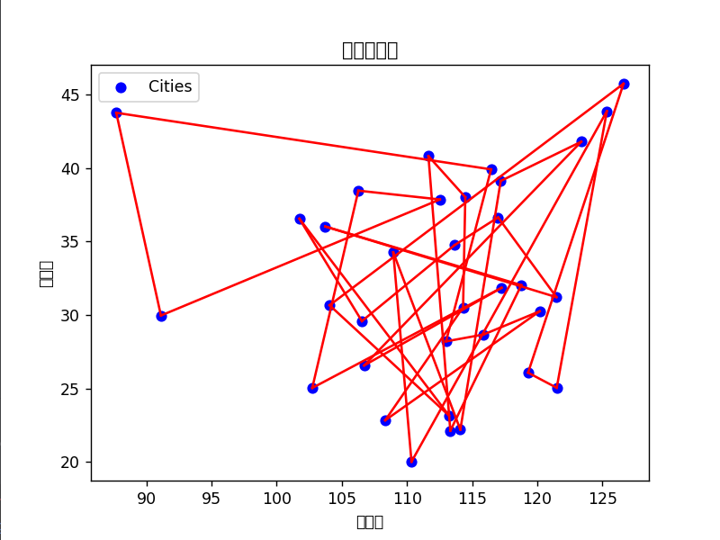
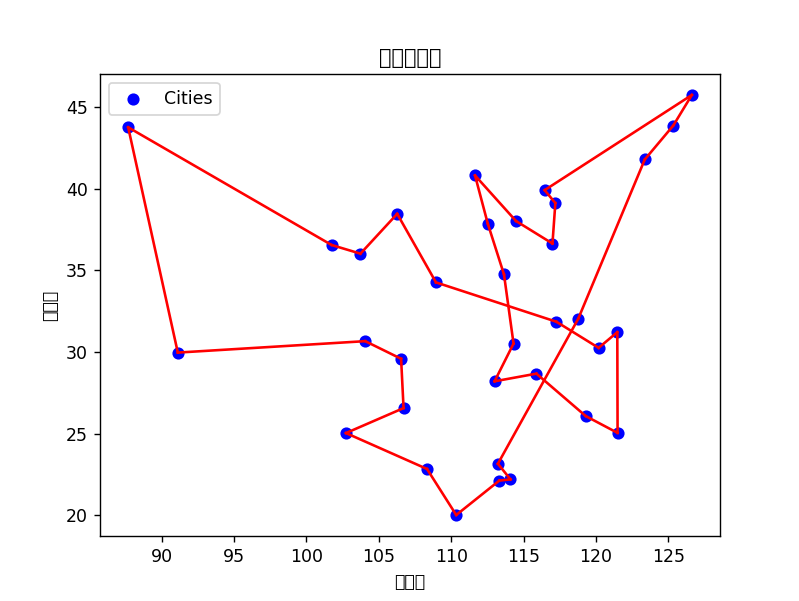

# 🧬 Genetic Algorithm for the Traveling Salesman Problem (TSP)

📘 **Project Overview**  
This project implements a **Genetic Algorithm (GA)** to solve the **Traveling Salesman Problem (TSP)** using Python.  
Given the coordinates of 34 Chinese cities, the algorithm seeks to find the **shortest possible route** that visits each city once and returns to the starting point.  

Two selection strategies — **Roulette Wheel Selection** and **Tournament Selection** — are compared to demonstrate how different evolutionary parameters (population size, crossover rate, mutation rate) affect convergence, path optimality, and stability.

---

## ⚙️ Folder Structure

```plaintext
.
├── main.py                          # Core genetic algorithm implementation
├── coordinate.xlsx                   # 34-city coordinates dataset
├── 轮盘赌选择可视化.png                 # Visualization for Roulette Wheel Selection
├── 锦标赛选择可视化.png                 # Visualization for Tournament Selection
└── README.md                         # Project documentation (this file)
```

---

## 🚀 Features

- 🧩 **Genetic Algorithm Framework**
  - Population initialization with random TSP paths  
  - Fitness evaluation using path length reciprocal  
  - Selection: Roulette Wheel or Tournament strategy  
  - Crossover: two-point crossover  
  - Mutation: swap mutation  

- 📊 **Parameter Customization**
  - Adjustable population size, crossover rate, and mutation rate  
  - Visualizes search convergence and best path for both selection methods  

- 🗺️ **Visualization**
  - Displays all 34 cities and optimal route in 2D space  
  - Saves comparison plots:
    - `轮盘赌选择可视化.png` → Roulette method
    - `锦标赛选择可视化.png` → Tournament method

---

## 🧩 Code Overview

### 🔹 Core Components

```python
# Distance and Path Calculation
def distance(city1, city2):
    return np.linalg.norm(city1 - city2)

def calculate_path_length(path):
    total = sum(distance(cities[path[i]], cities[path[i+1]]) 
                for i in range(len(path)-1))
    total += distance(cities[path[-1]], cities[path[0]])  # return to start
    return total
```

```python
# Selection Operators
def roulette_wheel_selection(population, fitness_values):
    total_fitness = np.sum(fitness_values)
    probabilities = fitness_values / total_fitness
    return np.random.choice(len(population), p=probabilities)

def tournament_selection(population, fitness_values, k=5):
    selected = np.random.choice(len(population), k, replace=False)
    best = np.argmax([fitness_values[i] for i in selected])
    return selected[best]
```

```python
# Genetic Operations
def crossover(parent1, parent2):
    start, end = np.random.randint(0, len(parent1), 2)
    if start > end: start, end = end, start
    child = np.zeros_like(parent1)
    child[start:end] = parent1[start:end]
    remaining = [i for i in parent2 if i not in child]
    child[:start] = remaining[:start]
    child[end:] = remaining[start:]
    return child

def mutate(path):
    a, b = np.random.choice(len(path), 2, replace=False)
    path[a], path[b] = path[b], path[a]
    return path
```

---

## 🧠 Algorithm Flow

```plaintext
1. Initialize city coordinates and parameters
2. Generate initial population (random paths)
3. Compute fitness for each individual
4. Apply selection, crossover, and mutation
5. Repeat for N generations
6. Output the shortest path and visualize the result
```

---

## 🧪 Experimental Setup

| Parameter | Value | Description |
|------------|--------|-------------|
| Population Size | 80–100 | Larger populations improve exploration |
| Generations | 100–1000 | Controls evolutionary depth |
| Crossover Rate | 0.6–0.7 | Controls offspring diversity |
| Mutation Rate | 0.02–0.04 | Avoids premature convergence |
| Dataset | 34 cities (from `coordinate.xlsx`) |
| Environment | Python 3.10 + NumPy + Pandas + Matplotlib |

---

## 📈 Results Summary

### ⚙️ Roulette Wheel Selection
- **Best path length:** ≈ 431.39  
- **Observation:** Results fluctuate due to probabilistic parent selection.  
- **Convergence:** Unstable; sensitive to random initialization.

### 🧩 Tournament Selection
- **Best path length:** ≈ 170.03  
- **Observation:** Produces more stable and optimal solutions.  
- **Convergence:** Faster and less random than Roulette selection.

---

## 🧩 Key Insights

| Parameter | Effect |
|------------|--------|
| **Population Size** | Larger values improve global exploration but increase runtime. |
| **Crossover Rate** | High crossover speeds convergence but risks premature optimization. |
| **Mutation Rate** | High mutation helps escape local minima but introduces randomness. |
| **Selection Strategy** | Tournament selection yields more consistent global minima. |

**Overall Conclusion:**  
Tournament selection, with a balanced crossover (0.65) and mutation rate (0.03), offers the best compromise between exploration and exploitation in TSP optimization.

---

## ⚙️ Run the Code

### ▶ Execute the Algorithm
```bash
pip install numpy pandas matplotlib
python main.py
```

### 💡 Output
- Terminal: Best path sequence and total distance  
- Figures: Optimal route plots saved to `.png` files  

---

## 🧩 Example Visualization

| Roulette Selection | Tournament Selection |
|--------------------|----------------------|
|  |  |

---

## 📄 References

- Goldberg, D. E. (1989). *Genetic Algorithms in Search, Optimization, and Machine Learning.* Addison-Wesley.  
- Holland, J. H. (1975). *Adaptation in Natural and Artificial Systems.* University of Michigan Press.  
- Wikipedia: [Traveling Salesman Problem](https://en.wikipedia.org/wiki/Travelling_salesman_problem)

---

## 👨‍💻 Author

**Ailixiaer Ailika**  
Bachelor Project — *Artificial Intelligence Techniques (Experiment 3)*  
📍 University Project Repository (Educational Use)

---

## 🪪 License

Released under the **MIT License**.  
Free to use, modify, and redistribute with proper attribution.
